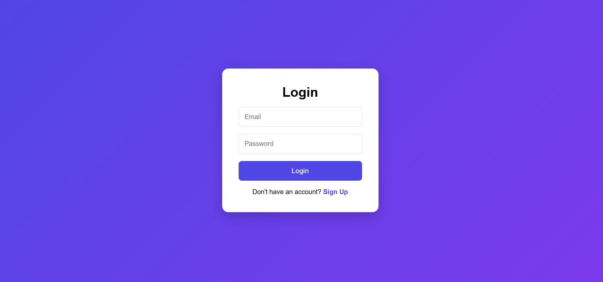
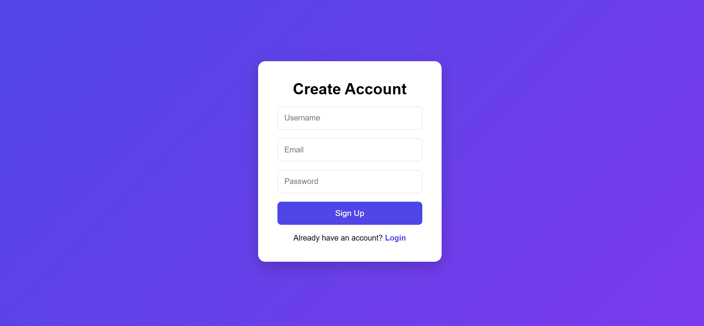
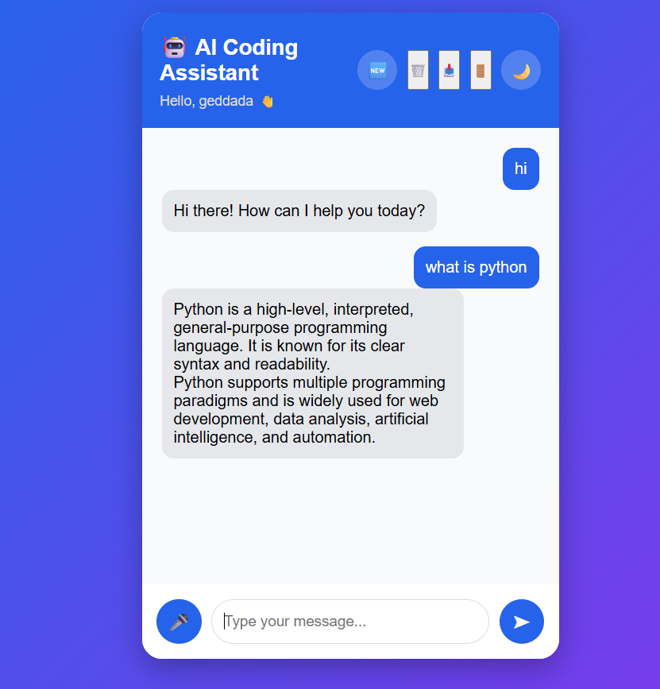
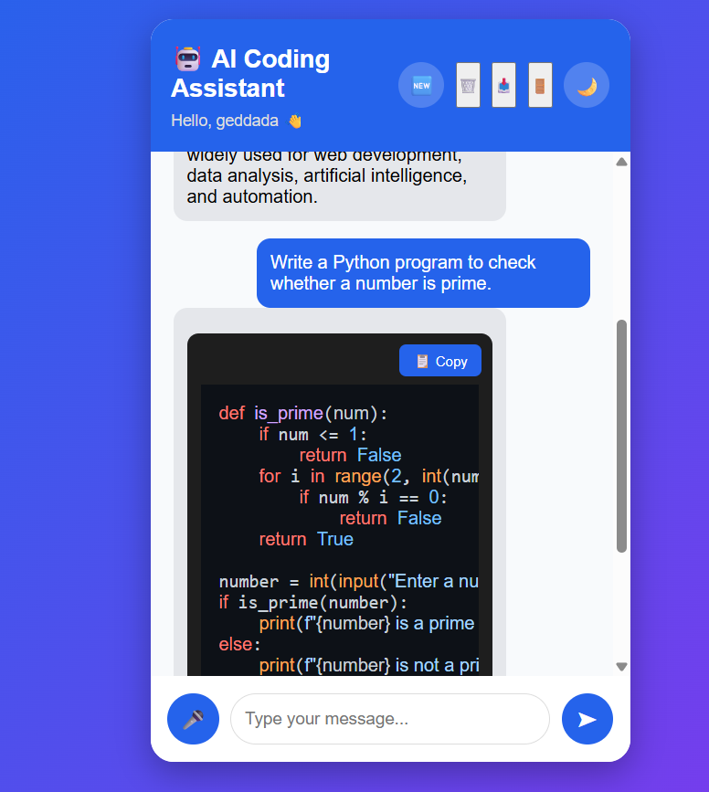
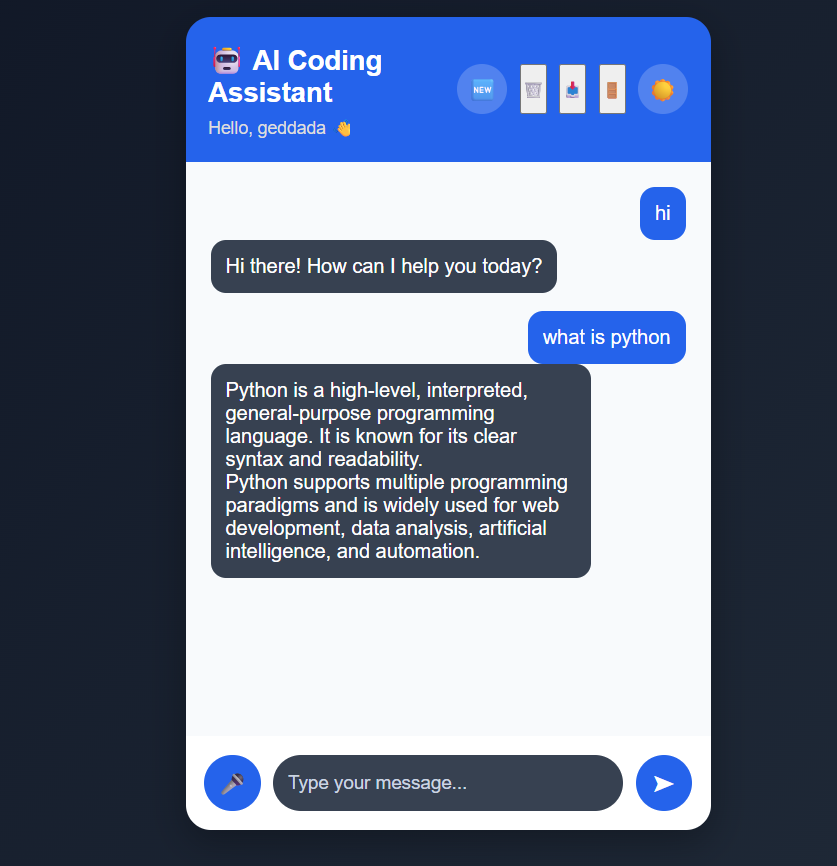

# 🤖 AI Coding Assistant

A Full Stack AI Coding Assistant built using Flask, Google Gemini AI, SQLite, HTML, CSS, and JavaScript.

## 🚀 Features

- 🔐 User Login & Signup Authentication
- 💬 AI Chat powered by Google Gemini
- 📝 Markdown Support
- 🎨 Code Syntax Highlighting
- 📋 Copy Code Button
- 🎤 Voice Input
- 🌙 Dark / Light Theme
- 📜 Chat History
- 🗑️ Clear Chat History
- 📥 Export Chat
- 🔒 Secure Password Hashing
- 💾 SQLite Database

---

## 🛠️ Tech Stack

- Python
- Flask
- Google Gemini AI
- SQLite
- HTML5
- CSS3
- JavaScript
- Highlight.js
- Marked.js

---

## 📂 Project Structure

```
AI-Coding-Assistant/
│
├── static/
│   ├── css/
│   └── js/
│
├── templates/
│
├── app.py
├── database.py
├── chatbot.py
├── requirements.txt
├── README.md
└── .gitignore
```

---

## ⚙️ Installation

Clone the repository

```bash
git clone https://github.com/gowthamgeddada364-create/AI-Coding-Assistant.git
```

Go to project folder

```bash
cd AI-Coding-Assistant
```

Install dependencies

```bash
pip install -r requirements.txt
```

Create a `.env` file

```env
GEMINI_API_KEY=YOUR_API_KEY
```

Run the project

```bash
python app.py
```

Open

```
http://127.0.0.1:5000
```

---

## 📸 Screenshots

### 🔐 Login Page



---

### 📝 Signup Page



---

### 🏠 Home Page



---

### 🤖 AI Response



---

### 🌙 Dark Mode



---

## 🔮 Future Improvements

- Live Deployment
- Multiple AI Models
- Image Upload
- File Upload
- Chat Search
- User Profiles

---

## 👨‍💻 Developer

**Gowtham Geddada**

GitHub:
https://github.com/gowthamgeddada364-create